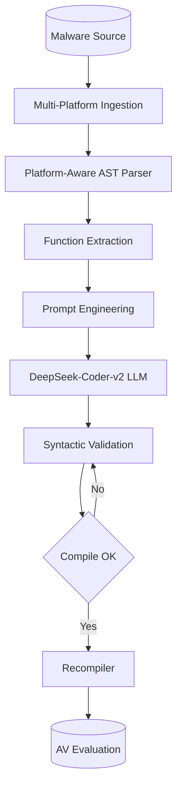
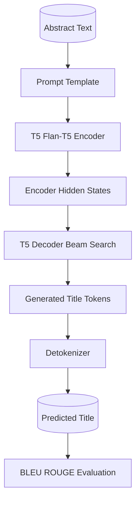
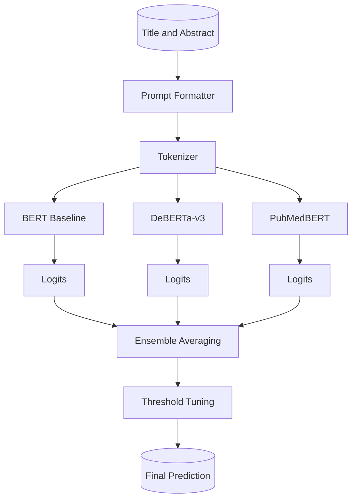
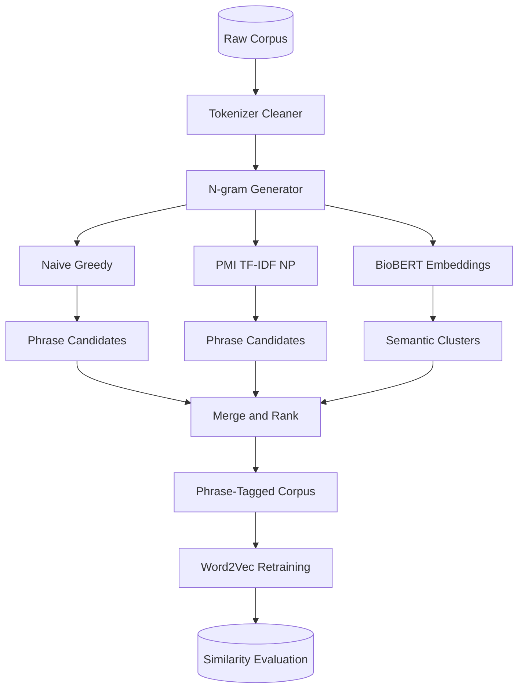

<!-- A curated portfolio of NLP and machine learning projects completed as part of graduate coursework. Each project explores a different facet of text analytics; from unsupervised phrase mining to transformer-based classification and abstractive summarization. Descriptions are generalized and omit proprietary dataset details. -->

---

## MPMalGen: Multi-Platform LLM-Powered Malware Variant Generation

A framework extending LLM-based malware variant generation to multi-platform environments (Windows & Android), featuring platform-specific transformation strategies and automated validation pipelines.

**Highlights**
- Extended the LLMalMorph framework with multi-platform support for Windows (C/C++) and Android (Java/Kotlin/Smali) malware sources.
- Introduced Android-specific prompt engineering strategies preserving component lifecycles, manifest registrations, and permission models.
- Integrated DeepSeek-Coder-v2-16B-Instruct for superior code transformation; implemented automated syntactic validation and error recovery pipelines.
- Evaluated on 4 Windows malware families and 1 Android project and 1 APK; achieved similar AV evasion rates compared to SOTA.

**System Architecture**

**Report**: [Download PDF](/files/projects/mmislam_Final_project_report.pdf)  
**Presentation**: [Watch Video](/files/projects/mmislam_Final_Presentation.mp4)

---

## Abstractive Title Generation

Sequence-to-sequence models for generating concise paper titles from scientific abstracts, comparing model capacity and instruction tuning.

**Highlights**
- Fine-tuned T5-small, T5-base, and Flan-T5-base with beam search (beams=4), no-repeat bigrams, and early stopping.
- T5-base improved BLEU by ~19% and ROUGE-L by ~8% over T5-small; Flan-T5 achieved the highest test ROUGE-L (0.439).
- Conducted hyperparameter sweeps on epochs and learning rate; identified 5 epochs and lr = 5×10⁻⁴ as optimal for the mid-sized corpus.

**System Architecture**

**Report**: [Download PDF](/files/projects/Project_3_report_mmislam.pdf)

---

## Biomedical Document Classification

Binary classification of scientific abstracts using transformer models, addressing severe class imbalance (~10:1) and train-test distribution mismatch.

**Highlights**
- Fine-tuned BERT, DeBERTa-v3, and PubMedBERT with focal loss and weighted sampling to handle class imbalance.
- Implemented curriculum learning by ranking samples by prediction uncertainty and training on progressively harder subsets.
- Ensembled DeBERTa and PubMedBERT via probability averaging; achieved max F1 ≈ 0.88 and F1 ≈ 0.87 on the public and private leaderboards respectively in the corresponding Kagle competition.

**System Architecture**

**Report**: [Download PDF](/files/projects/Project_2_report_mmislam.pdf)

---

## Phrase Mining & Word Embeddings 

An end-to-end pipeline for extracting and evaluating multi-word phrases from a large biomedical corpus, then retraining Word2Vec embeddings on the phrase-tagged text.

**Highlights**
- Compared three phrase-mining strategies: naive greedy segmentation, a statistical mixed-method approach (PMI + TF-IDF + spaCy noun chunks), and a BioBERT-based semantic clustering method.
- Trained Word2Vec (skip-gram) before and after phrase tagging; observed tighter semantic clusters and higher cosine similarities for domain-specific terms after tagging.
- Validated extracted phrases against a curated phrase dictionary; the mixed-method approach achieved the best balance of coverage and precision.

**System Architecture**

**Report**: [Download PDF](/files/projects/Project_1_report_mmislam.pdf)  
**Presentation**: [Watch Video](/files/projects/mmislam_Final_Presentation.mp4)
